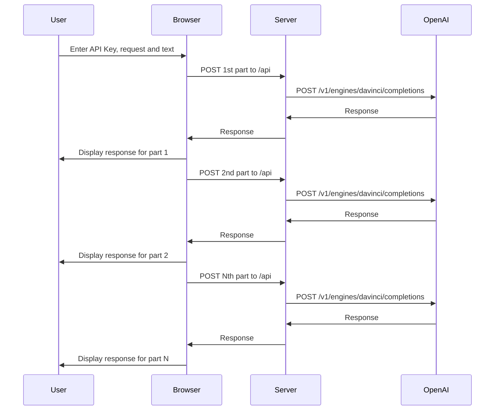

# Fat Chat GPT

This application is a simple web page that let user to enter a big text, a request, split the text then send each part with the request to OpenAI api.

An openai API key is required to use this application. You can get one here: https://beta.openai.com/docs/api-reference/authentication

The application is deployed on Vercel: https://fat-chatgpt.vercel.app/

Your API key and request is^stored in the browser local storage so there is no need to retype it if you go back on the page.

The API key is not stored in the server.

The application is built with Next.js and hosted by Vercel.


Here the sequence diagram of the application:



## Getting Started

First, run the development server:

```bash
npm i

npm run dev
```
